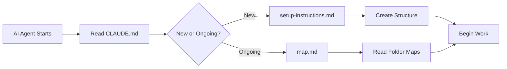

# AI Development Repository Template

**Version**: October 2025

This repository serves as a template for AI-assisted development projects. It provides a structured workspace designed to facilitate effective collaboration between developers and AI assistants (particularly Claude Code).

## Purpose

This template demonstrates an organized repository structure optimized for AI-development workflows. It implements a hierarchical context system that enables AI agents to:

- **Understand project context progressively** through layered CLAUDE.md files
- **Navigate project stages** with guidance for both setup and ongoing development
- **Maintain organized outputs** with dedicated folders for AI-generated content
- **Follow structured workflows** using folder-specific maps and documentation

The architecture supports both new project initialization and collaborative work on existing codebases.

## Key Features

### Hierarchical Context Chain

The template uses a multi-layered context system:

1. **System Level**: Global user context (`~/CLAUDE.md`)
2. **Repository Group**: Repos directory context (`~/repos/CLAUDE.md`)
3. **Project Level**: Project-specific context (`CLAUDE.md`)
4. **Guidance Layer**: Setup and workflow documentation (`claude-guidance/`)
5. **Folder Level**: Directory-specific maps (`*/map.md`)

See [flow.md](flow.md) for detailed flowcharts visualizing the context architecture.

### Organized Structure

- **`/claude-guidance/`**: AI agent guidance for setup and ongoing work
- **`/for-ai/`**: Input files for AI agent processing
- **`/from-ai/`**: AI-generated outputs and artifacts
- **`/context/`**: Additional project context information
- **`/src/`**: Source code (with its own map.md)
- **`/docs/`**: Project documentation (with its own map.md)
- **`/tests/`**: Test suites (with its own map.md)

## Quick Start

### Using as a Template

1. **Fork or clone** this repository:
   ```bash
   git clone https://github.com/danielrosehill/AI-Dev-Repo-Template-Oct-2025.git my-new-project
   cd my-new-project
   ```

2. **Customize CLAUDE.md** at the project root:
   - Update `{user}` placeholder with your name
   - Update `{project-purpose}` with your project description

3. **Follow setup guidance**:
   - For new projects: See `claude-guidance/setup-instructions.md`
   - For ongoing work: See `claude-guidance/map.md`

4. **Initialize version control**:
   ```bash
   git remote remove origin
   git remote add origin your-repo-url
   git push -u origin main
   ```

### Working with AI Assistants

When starting a Claude Code session:

1. The AI agent reads `CLAUDE.md` to understand project purpose and structure
2. It checks the codebase status to determine project stage
3. It follows the appropriate guidance path (setup vs. ongoing)
4. It reads relevant folder maps for context on specific directories
5. It processes inputs from `/for-ai/` and outputs to `/from-ai/` as needed

## Documentation

- **[flow.md](flow.md)**: Visual flowcharts of the context hierarchy system
- **[claude-guidance/map.md](claude-guidance/map.md)**: Complete repository structure documentation
- **[claude-guidance/setup-instructions.md](claude-guidance/setup-instructions.md)**: Initial project setup guidance
- **[version-control.md](version-control.md)**: Git workflow and version control practices

## Folder Purposes

| Folder | Purpose |
|--------|---------|
| `/claude-guidance/` | AI agent instructions and repository maps |
| `/for-ai/` | Files for AI agent to read and process |
| `/from-ai/` | AI-generated outputs and artifacts |
| `/context/` | Additional project context documents |
| `/src/` | Source code and implementation |
| `/docs/` | Project documentation and guides |
| `/tests/` | Test suites and testing utilities |
| `/planning/` | Project planning and task management |
| `/scripts/` | Utility scripts and automation |

Each major folder should contain its own `map.md` to provide localized context.

## Design Philosophy

This template embodies several key principles:

1. **Progressive Disclosure**: AI agents load only relevant context for their current task
2. **Stage-Aware Branching**: Different guidance for project setup vs. ongoing development
3. **Distributed Context**: Folder maps provide localized guidance where needed
4. **Hierarchical Inheritance**: Context flows from global to project to folder level
5. **Clear Separation**: Distinct directories for inputs (`/for-ai/`) and outputs (`/from-ai/`)

## Customization

Adapt this template to your needs:

- **Add custom folders**: Create new directories with their own `map.md` files
- **Extend guidance**: Add project-specific instructions to `claude-guidance/`
- **Modify context flow**: Adjust CLAUDE.md files at different levels
- **Add workflows**: Document specialized workflows in `/docs/` or `claude-guidance/`

## Best Practices

1. **Keep CLAUDE.md files updated** as project purpose or structure evolves
2. **Create folder maps** for any new significant directories
3. **Use `/for-ai/` and `/from-ai/`** to maintain clear AI interaction boundaries
4. **Document workflows** in `claude-guidance/` for repeatable processes
5. **Version control everything** including guidance documents and maps

## Context System in Action



See [flow.md](flow.md) for comprehensive flowcharts.

## Version History

- **October 2025**: Initial template release with hierarchical context system

## Contributing

This template is meant to be adapted. Feel free to:
- Fork and customize for your needs
- Share improvements and variations
- Adapt the structure to different workflows

## License

This template structure and documentation are provided as-is for use in your projects.

## Author

**Daniel Rosehill**
- Website: [danielrosehill.com](https://danielrosehill.com)
- Email: public@danielrosehill.com
- GitHub: [@danielrosehill](https://github.com/danielrosehill)

---

*This template represents AI-assisted development patterns as of October 2025. The structure is designed to work particularly well with Claude Code but can be adapted for other AI development assistants.*
