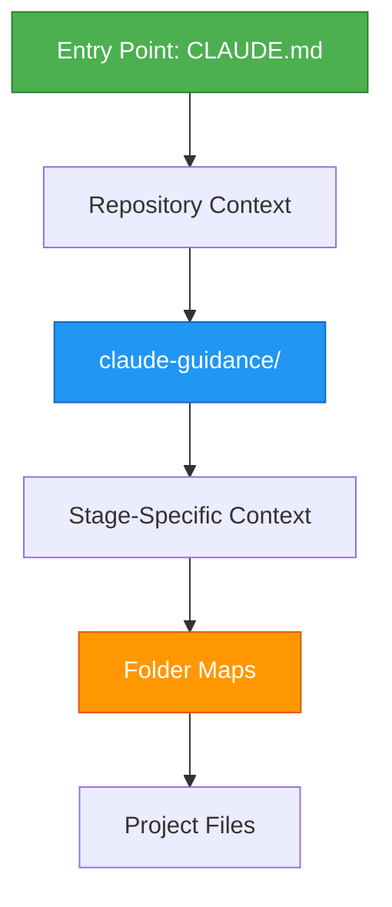
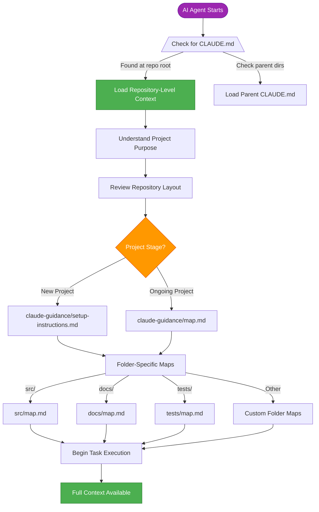
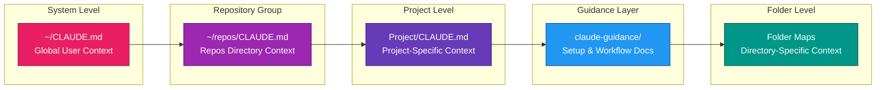
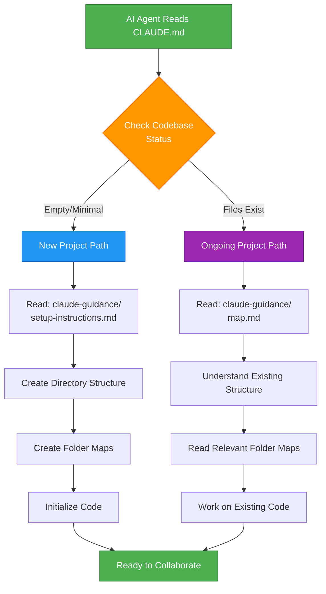

# Hierarchical Context Chain

This document visualizes the context flow architecture for AI agent guidance within this repository.

## Overview Flow

## Detailed Context Hierarchy

## Context Layers

## Setup vs. Ongoing Project Flow

## Key Principles

1. **Hierarchical Inheritance**: Context flows from global → repository group → project → folder level
2. **Stage-Aware Branching**: Different guidance paths for setup vs. ongoing development
3. **Distributed Context**: Folder maps provide localized context where needed
4. **Progressive Disclosure**: AI agent loads only relevant context for current task